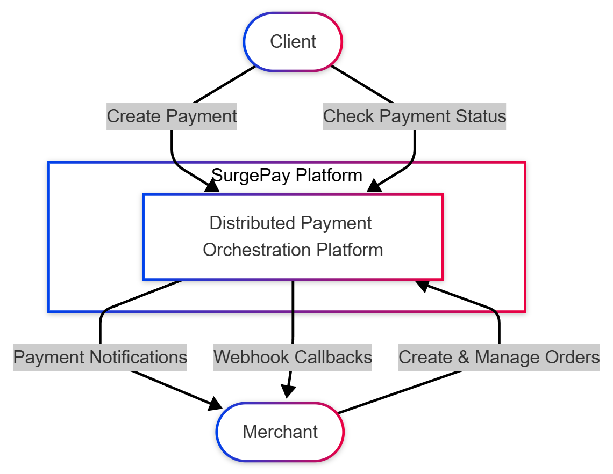
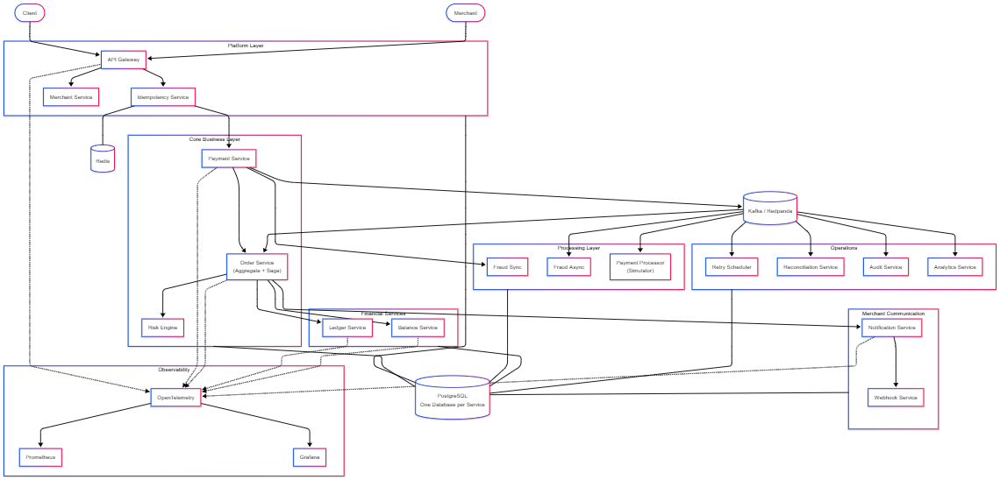
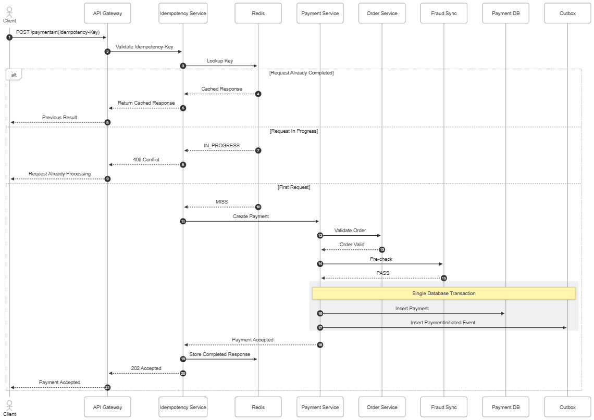
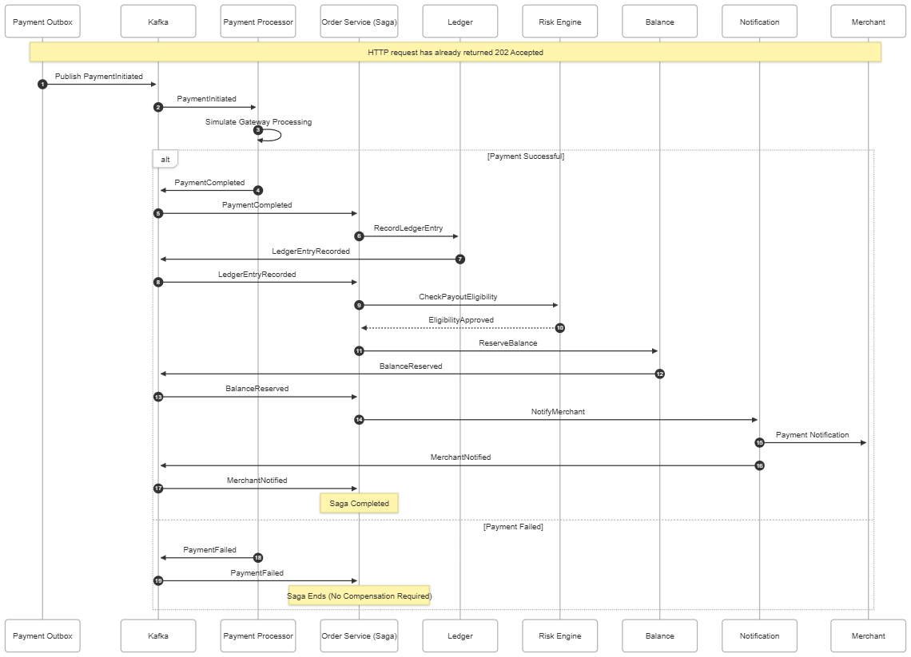
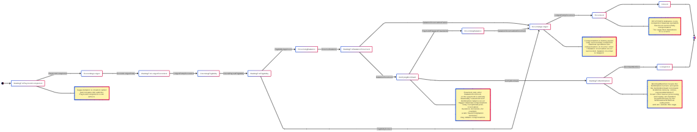
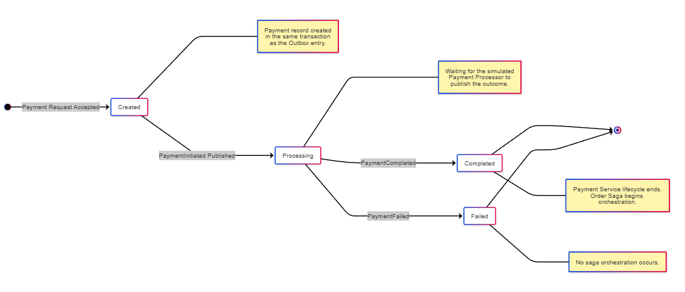
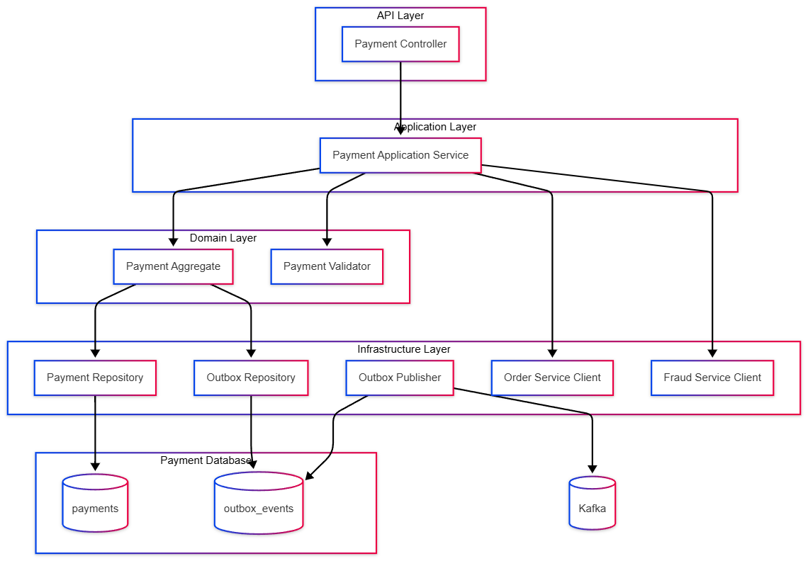
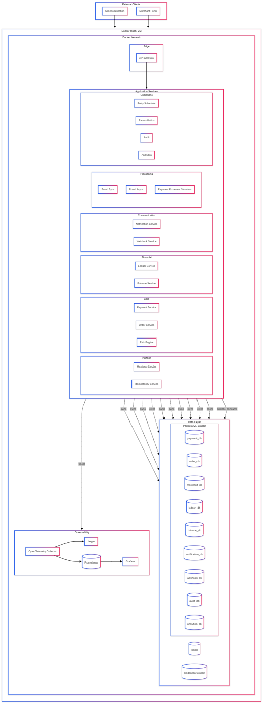
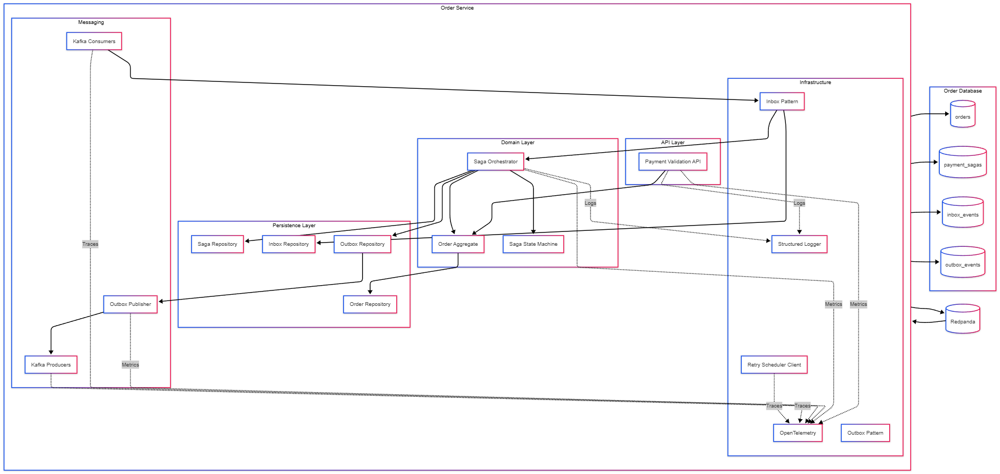
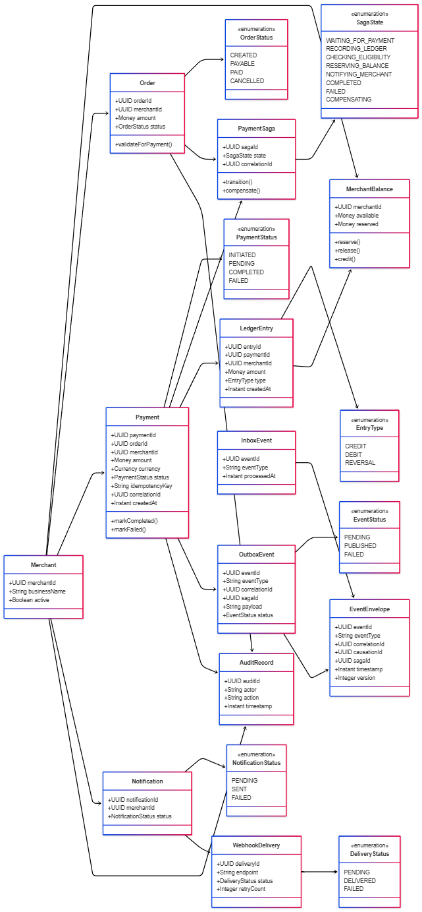

# SurgePay — Distributed Payment Orchestration Platform

SurgePay is a production-inspired, event-driven distributed payment orchestration platform designed to demonstrate modern, high-reliability fintech architectures. It is built as a portfolio-grade learning resource to model how complex distributed workflows, transactional guarantees, and eventual consistency are coordinated in real-world payment networks.

> [!IMPORTANT]
> **SurgePay is a simulation.** It does not integrate with a real payment gateway. Instead, it focuses on solving the distributed consistency and coordination challenges that surround payment gateways—keeping order state, ledger entries, merchant balances, and notification states aligned across independent services that can fail, timeout, restart, or receive duplicate messages at any time.

---

## 1. Project Overview

SurgePay demonstrates how a highly resilient payment orchestration platform handles distributed state transitions. Rather than focusing on simple database updates, the platform targets the core architectural challenges of payment processing:
- **Consistency Without Distributed Transactions**: Guarantees eventual consistency and transaction integrity without relying on expensive and brittle 2PC/XA protocols.
- **Idempotent Executions**: Prevents double-spend, double-ledgering, or duplicate notifications at both the HTTP request and Kafka messaging layers.
- **Explicit Failure States**: Implements bounded recovery paths, structured retries, and dead-letter queueing to ensure that no message is ever silently lost.
- **Microservice Boundaries**: Enforces database per service, strictly preventing any database sharing or cross-schema querying.

---

## 2. Architecture Overview

At a high level, the platform consists of 16 independent, service-oriented modules coordinated through a mix of synchronous APIs and asynchronous event-driven flows:
- **API Gateway**: Single entry point handling TLS termination, rate-limiting, and request routing.
- **Idempotency Service**: Redis-backed cache to intercept duplicate HTTP requests at the gateway level.
- **Payment Service**: Owns the payment record and initiates processing transactions.
- **Merchant Service**: Manages merchant profiles, API credentials, fees, and configurations.
- **Order Service**: Manages the order aggregate and hosts the Saga Orchestrator for asynchronous workflows.
- **Ledger Service**: Immutable, double-entry financial record book.
- **Balance Service**: Projects and reserves merchant balances derived from ledger history.
- **Notification Service**: Coordinates external communication triggers.
- **Webhook Service**: Delivers secure, signature-validated payment events to merchants.
- **Fraud Service**: Performs synchronous pre-checks and deep asynchronous fraud scoring.
- **Risk Engine**: Manages dynamic transaction limits and reserve ratios.
- **Payment Processor Simulator**: Simulates third-party merchant bank and card network integrations.
- **Retry Scheduler**: Coordinates exponential backoff and jittered event retries.
- **Audit Service**: Records immutable operational actions for compliance.
- **Analytics Service**: Aggregates real-time transaction performance metrics.
- **Reconciliation Service**: Discovers financial anomalies between internal records and payment networks.

### Core Architecture Patterns
- **Transactional Outbox**: Guarantees atomic database updates and event publishing.
- **Saga Orchestrator**: Manages multi-step payment workflows and compensation logic.
- **Inbox Pattern (Deduplication)**: Enforces event-level idempotency inside consumers.
- **Redis-Backed Lock**: Manages gateway request-level idempotency.
- **OpenTelemetry & Prometheus/Grafana**: End-to-end trace propagation and critical business metrics tracking.

### 2.1 Synchronous Request Pipeline

This section details the synchronous request flow. This pipeline represents the only part of the system where an external client waits synchronously for a response. It is designed to be extremely thin, fast, and secure.

```
Client Request (with X-API-Key and Idempotency-Key)
    │
    ▼
API Gateway (TLS termination, routing, header verification)
    │
    ▼
Merchant Authentication (delegated synchronously to Merchant Service)
    │
    ▼
Rate Limiting (sliding window check backed by Redis Sorted Sets)
    │
    ▼
Idempotency Service (intercepts mutating requests, locks/checks via Redis)
    │
    ▼
[Next Steps: Payment Service -> Fraud Pre-Check -> DB Transaction (Payment + Outbox) -> 202 Accepted]
    │
    ▼
Gateway Response
```

* **API Gateway**: The API Gateway (`apps/gateway`) acts as the single gateway interface. It handles request ingress, routing, TLS, and initial header validation. The Gateway is designed to be **intentionally thin** and carries **no business or payment logic**. It does not perform local authentication or idempotency calculations, delegating those tasks downstream.
* **Merchant Authentication**: Authentication is enforced at the Gateway but delegated to the **Merchant Service** (`apps/merchant-service`). The Gateway extracts the `X-API-Key` from headers and validates it by executing a synchronous internal call to the Merchant Service. The Merchant Service hashes the key (SHA-256) and verifies its existence and status (e.g., active/inactive) against PostgreSQL. If authentication fails, the Gateway returns a `401 Unauthorized` or `403 Forbidden` response.
* **Merchant-aware Rate Limiting**: To prevent abuse and protect downstream systems, the Gateway applies sliding window rate limiting. The limit is determined dynamically per merchant. The rate limiter is backed by **Redis** and leverages Redis Sorted Sets (ZSET) to track timestamp-based requests. When a merchant exceeds their configured rate (e.g., 100 requests per minute), the Gateway blocks the request with a `429 Too Many Requests` status and returns standard rate-limiting headers:
  - `X-RateLimit-Limit`: Maximum requests permitted per window.
  - `X-RateLimit-Remaining`: Requests remaining in the current window.
  - `X-RateLimit-Reset`: Unix epoch time when the rate limit window resets.
  - `Retry-After`: The number of seconds the client must wait before retrying.
* **Request-level Idempotency**: To prevent duplicate state changes (such as duplicate payments), all mutating requests (POST, PUT, PATCH) require an `Idempotency-Key` header. The Gateway delegates check/set actions to the **Idempotency Service** (`apps/idempotency-service`), which coordinates the request lifecycle via **Redis**:
  - **Cache Miss**: A short-lived distributed lock is acquired. The request continues to the business service (the mock returns `202 Accepted` for now). Upon completion, the HTTP response status and body are saved in Redis with a 24-hour TTL, and the lock is released.
  - **Cache Hit (In-Progress)**: If a duplicate request arrives while the first is still processing, the service returns `409 Conflict` to prevent concurrent execution of the same transaction.
  - **Cache Hit (Completed)**: If the request already completed, the service retrieves the cached response from Redis and immediately returns it. The downstream services are never executed twice.
  - **Payload Validation**: If a duplicate key is reused with a different request payload, the service detects a checksum mismatch and rejects the request with `422 Unprocessable Entity` (error: `IDEMPOTENCY_KEY_REUSED_WITH_DIFFERENT_REQUEST`).

---

## 3. Tech Stack

- **Core & Runtime**: TypeScript, Node.js (>=20.0.0)
- **Application Framework**: NestJS (v10)
- **Database & ORM**: PostgreSQL, Prisma ORM
- **In-Memory Caching & Lock Manager**: Redis
- **Message Broker & Event Stream**: Redpanda (Kafka-compatible)
- **Workspace Tooling**: TurboRepo, pnpm (>=9.0.0)
- **Infrastructure**: Docker Compose
- **Observability**: OpenTelemetry, Prometheus, Grafana

---

## 4. Repository Layout

```
surgepay/
├── apps/                        # Core Application Services
│   ├── gateway/                 # API Gateway Service
│   ├── idempotency-service/     # Request Deduplication Service
│   ├── merchant-service/        # Merchant Configurations
│   ├── payment-service/         # Payment Aggregate & Outbox
│   ├── order-service/           # Order Aggregate & Saga Orchestrator
│   ├── ledger-service/          # Immutable Double-Entry Ledger
│   ├── balance-service/         # Merchant Balances & Reserves
│   ├── fraud-service/           # Sync Pre-check & Async Scoring
│   ├── risk-engine/             # Risk Analysis Engine
│   ├── payment-processor/       # Gateway Simulator
│   ├── webhook-service/         # Outbound Webhook Delivery
│   ├── notification-service/    # Email/SMS Merchant Notifications
│   ├── retry-scheduler/         # Outbox & Failed Event Retrier
│   ├── audit-service/           # Compliance Logging
│   ├── analytics-service/       # Operational Analytics
│   └── reconciliation-service/  # Discrepancy Auditing
├── packages/                    # Shared Monorepo Packages
│   ├── common/                  # Shared utilities, health checks, and standard logger
│   ├── config/                  # Shared environment and config schemes
│   ├── contracts/               # Shared HTTP/RPC DTOs and API specifications
│   ├── database/                # Shared Prisma client, schemas, migrations, and seeds
│   └── events/                  # Shared Kafka Event envelope and schemas
├── docker/                      # Docker files and container compose stack
├── infrastructure/              # Deployment orchestration (Helm, Terraform, etc.)
├── docs/                        # Project design documentation and specs
├── scripts/                     # Utility scripts for local dev, seeds, and migrations
├── diagrams/                    # System architecture Mermaid designs & PNGs
└── .github/                     # Issue, PR templates and CI/CD GitHub Action workflows
```

---

## 5. Getting Started

### Local Setup
Ensure you have **Node.js (>=20.0.0)**, **pnpm (>=9.0.0)**, and **Docker** installed.

#### 1. Clone the Repository
```bash
git clone <repository_url>
cd surgepay
```

#### 2. Install Dependencies
```bash
pnpm install
```

#### 3. Environment Configuration
Copy the development environment template to create your local environment file:
```bash
cp .env.example .env.development
```
Verify the default values inside `.env.development` are correct for your local setup.

#### 4. Start Infrastructure
Launch the local Docker containers:
```bash
cd docker
docker compose up -d
cd ..
```
Wait for all containers to report healthy. You can verify this by running `docker ps`.

#### 5. Verify Workspace Setup
You can verify the TypeScript compilation of all shared packages:
```bash
pnpm build
```

---

## 6. Testing Guide

SurgePay provides a comprehensive testing suite that checks both unit functionality and full integration correctness across services.

### Local Development Commands
Common command sequence to boot and verify local environment:
```bash
# 1. Install workspace dependencies
pnpm install

# 2. Start all dockerized dependencies in the background
cd docker && docker compose up -d && cd ..

# 3. Compile and build workspace packages/apps
pnpm build

# 4. Start all services in hot-reload development mode
pnpm dev

# 5. Run full test suites (unit + integration)
pnpm test

# 6. Run end-to-end tests
pnpm test:e2e
```

### Purpose of Test Suites
* **Integration Tests**: Verify service-to-service contracts and correct interface implementations under external resource contexts (like database operations or caching lookups). They use **Testcontainers** to dynamically spin up clean, isolated Docker instances of PostgreSQL and Redis during the test run.
* **End-to-End (E2E) Tests**: Verify complete synchronous request behavior end-to-end against a running local stack. This ensures that middleware sequences (API Gateway -> Authentication -> Rate Limiting -> Idempotency checks) route traffic correctly, handle concurrent lock collisions, and resume cache queries without side effects.
* **Health Endpoints**: Allow operations or load balancers to monitor whether services are operational. The health checks monitor external downstream connections (PostgreSQL, Redis, Redpanda) and report an aggregated health status.
* **Swagger/OpenAPI**: Provides a live web interface (e.g., `http://localhost:3000/api-docs`) to inspect API schemas, models, payload contracts, and to execute testing calls directly from a browser.
* **Infrastructure Verification**: Confirms that database migrations, connection pools, queue systems, and telemetry endpoints are fully configured and functional before handling customer traffic.

---

## 7. Smoke Tests

To confirm that the platform is operating correctly, execute the following HTTP calls against the API Gateway (`http://localhost:3000`):

### 1. Health Probe Verification
* **Command**:
  ```bash
  curl -i http://localhost:3000/health
  ```
* **Expected Output**:
  - Status: `200 OK`
  - Body: JSON payload demonstrating aggregated service health (e.g., status is `UP`, Redis is `UP`, Kafka is `UP`, PostgreSQL is `UP`).

### 2. Valid Payment Request
* **Command**:
  ```bash
  curl -i -X POST http://localhost:3000/api/v1/payments \
    -H "X-API-Key: sp_api_key_valid_here" \
    -H "Idempotency-Key: unique-idem-key-001" \
    -H "Content-Type: application/json" \
    -d '{"orderId":"ord_12345","amount":10000,"currency":"USD"}'
  ```
* **Expected Output**:
  - Status: `202 Accepted`
  - Body: Payment processing confirmation.

### 3. Duplicate Request Prevention
* **Command**:
  Re-send the exact same HTTP POST request above with the same `Idempotency-Key`.
* **Expected Output**:
  - Status: `202 Accepted` (Or matching the original response status)
  - Headers: Cached headers returned.
  - Downstream: The request is not processed twice (cached response is returned immediately).

### 4. Concurrent Request Collision
* **Command**:
  Send two identical requests simultaneously with the same `Idempotency-Key` before the first one completes.
* **Expected Output**:
  - Status: `409 Conflict` (for the second request) indicating that the operation is already in-progress.

### 5. Payload Mismatch Detection
* **Command**:
  Re-send a request with the same `Idempotency-Key` but with a different body (e.g., `"amount": 20000`).
* **Expected Output**:
  - Status: `422 Unprocessable Entity`
  - Body error code: `IDEMPOTENCY_KEY_REUSED_WITH_DIFFERENT_REQUEST`.

### 6. Authentication Rejection
* **Command**:
  Send a request with an invalid or missing API key.
  ```bash
  curl -i -X POST http://localhost:3000/api/v1/payments \
    -H "X-API-Key: invalid_key" \
    -H "Idempotency-Key: unique-idem-key-002"
  ```
* **Expected Output**:
  - Status: `401 Unauthorized` (if API key is invalid/unregistered) or `403 Forbidden` (if the merchant is disabled/inactive).

### 7. Rate Limiting Enforced
* **Command**:
  Send 101 requests within a 60-second window.
* **Expected Output**:
  - Status: `429 Too Many Requests`
  - Headers: `X-RateLimit-Limit`, `X-RateLimit-Remaining`, `X-RateLimit-Reset`, `Retry-After`.

---

## 8. Docker Services

The SurgePay platform depends on the following dockerized services to support high-reliability orchestrations and monitoring:

* **PostgreSQL** (Port `5432`): Provides isolated databases and schemas for each microservice, enforcing strict data ownership boundaries.
* **Redis** (Port `6379`): Backs the Idempotency Service to intercept duplicate HTTP requests at the gateway level.
* **Redpanda** (Port `9092`/`29092`): Kafka-compatible message broker that handles all asynchronous microservice event streams.
* **Kafka UI** (Port `8080`): Web-based user interface to monitor Redpanda clusters, topics, consumers, and message envelopes.
* **Prometheus** (Port `9090`): Time-series database that pulls metrics emitted from the platform microservices.
* **Grafana** (Port `3000`): Visualization dashboard displaying real-time metrics, SLOs, and alert indicators.
* **OpenTelemetry Collector** (Port `4317`/`4318`): Core routing pipeline to ingest distributed traces and logs from active services and forward them to downstream storage backends.

---

## 9. Development Commands

Common workspace tasks can be run directly using Turborepo and pnpm scripts at the root level:

```bash
# Clean build artifacts, dist files, and node_modules recursively
pnpm clean

# Install workspace dependencies
pnpm install

# Build all shared packages and verify TypeScript compilation
pnpm build

# Run formatting checks on TypeScript files
pnpm format

# Run linter checks (ESLint flat configuration)
pnpm lint

# Run automated tests across all packages
pnpm test

# Start dockerized infrastructure in the background
cd docker && docker compose up -d

# Stop running dockerized infrastructure
cd docker && docker compose down
```

---

## 10. Development Workflow

- **Feature-Driven**: All work is mapped to Git feature branches. Direct commits to `main` are disabled.
- **Code Reviews**: Every pull request requires review and approval from at least one engineer.
- **Conventional Commits**: Commit messages must follow the Angular Conventional Commits style and will be linted prior to commit checks.

---

## 11. Branch Strategy

We follow a trunk-based development strategy centered directly around the `main` branch.

```
Create feature branch (feature/<name>)
        ↓
Make local commits (Conventional Commits style)
        ↓
Push feature branch to remote repository
        ↓
Open Pull Request to `main`
        ↓
Review approved & CI checks pass
        ↓
Merge into `main` (Squash & Merge)
        ↓
Delete feature branch
```

- **No Long-Lived `develop` Branch**: Code goes from `feature/*` directly into `main` after validation.

---

## 12. Conventional Commit Examples

We use standard Conventional Commits scopes to identify affected modules.

- `feat(payment): implement payment creation`
- `fix(order): prevent duplicate saga execution`
- `refactor(common): simplify logger`
- `docs(readme): update architecture`
- `test(payment): add integration tests`
- `chore(repo): update workspace tooling`

---

## 13. Troubleshooting

If you run into issues during workspace setup, use the following guidelines:

* **Docker Not Running**:
  - *Symptom*: Docker compose commands hang or error with `cannot connect to Docker daemon`.
  - *Solution*: Start the Docker Desktop client or systemd service (`sudo systemctl start docker`).
* **Port Conflicts (e.g. 5432 or 6379)**:
  - *Symptom*: Container fails to start because a port is already in use.
  - *Solution*: Identify the conflicting process (e.g. a local PostgreSQL or Redis server running natively) and stop it, or update host ports in `.env.development` and `docker-compose.yml`.
* **Missing Environment Variables**:
  - *Symptom*: Setup scripts throw configuration schema validation errors.
  - *Solution*: Ensure you copied `.env.example` to `.env.development` and that the file is present in the workspace root.
* **Failed Dependency Installation**:
  - *Symptom*: `pnpm install` fails due to lockfile or resolution conflicts.
  - *Solution*: Run `pnpm clean` to wipe build caches and try running `pnpm install` again.
* **pnpm Workspace Issues**:
  - *Symptom*: Packages cannot resolve imports from neighbor workspace libraries (e.g. `@surgepay/common`).
  - *Solution*: Run `pnpm build` at the root level to compile shared packages and generate declaration files (`dist/` folder outputs), which allows TypeScript path aliases to resolve correctly.
* **Container Startup Failures**:
  - *Symptom*: Individual containers (like Redpanda or Grafana) restart in loops.
  - *Solution*: Run `docker compose logs <container-name>` to view specific container logs. Ensure you have allocated sufficient resource limits (e.g., memory) to Docker Desktop.

---

## 14. Repository Status & Verification

### Completed Capabilities
* **API Gateway**: Front-end routing, TLS, header verification, error normalization.
* **Merchant Service**: PostgreSQL-backed merchant schema, secure API key validation.
* **Idempotency Service**: Redis-backed distributed locks and HTTP request payload checksum caching.
* **Shared HTTP Client**: Normalized request/response wrappers, timeout and retry controls.
* **Merchant Authentication**: Decoupled validator middleware delegating API key verification downstream.
* **Redis-backed Rate Limiting**: Sliding window rate controller injecting HTTP rate headers dynamically.
* **Request-level Idempotency**: Prevention of double-spend or duplicate payment submissions.
* **Standard API Contracts**: Clean DTO structures and global error exception mapping.
* **OpenAPI Documentation**: Interactive Swagger interface.
* **Health Endpoints**: Live capability probes monitoring Redis, PostgreSQL, and Redpanda connections.
* **Integration Tests**: Isolated component validation via Testcontainers.
* **End-to-End (E2E) Tests**: Complete pipeline scenario flows.

### Final Verification Checklist
* [x] Gateway starts successfully on port `3000`
* [x] Merchant Service starts successfully on port `3001` and connects to PostgreSQL
* [x] Idempotency Service starts successfully on port `3002` and connects to Redis
* [x] Merchant API key verification successfully hashes and authenticates requests
* [x] Invalid and revoked API keys are properly rejected with a `401 Unauthorized` status
* [x] Rate limiting middleware successfully tracks sliding window limits per merchant and rejects exceeding requests with `429 Too Many Requests`
* [x] Idempotency checks correctly handle cache misses, in-progress locks (`409 Conflict`), and completed requests
* [x] Payload validation rejects idempotency key reuse with differing payloads (`422 Unprocessable Entity`)
* [x] Standard JSON error formats are consistently returned across all endpoints
* [x] Swagger documentation is generated at `/api-docs`
* [x] Health checks report readiness only when all databases/brokers are available
* [x] All integration tests pass successfully using Testcontainers
* [x] All End-to-End tests pass successfully against local docker infrastructure
* [x] Local monorepo compiles clean with zero linter errors

### 14.1 Preparation for Next iteration (Payment Request Path)
With the synchronous foundation of current iteration verified and stabilized, next iteration will introduce the first business logic workflow: processing an active payment.

The synchronous payment pipeline will follow this request path:
```
Client Request
    │
    ▼
API Gateway
    │
    ▼
Merchant Authentication
    │
    ▼
Idempotency Check
    │
    ▼
Payment Service
    │
    ▼
Order Validation (Synchronous check against Order Service)
    │
    ▼
Fraud Pre-check (Synchronous fraud score validation, <50ms)
    │
    ▼
Payment Database Write + Transactional Outbox (Single DB transaction)
    │
    ▼
202 Accepted (Response to Client)
```
During next iteration, the client's synchronous wait ends once the payment and its outbound event are safely persisted in a single PostgreSQL transaction. All downstream workflows (ledger indexing, balance updates, notifications) will run asynchronously in subsequent phases.

---

## 15. First Contribution Guide

Welcome to the SurgePay development team! Follow this checklist to complete your first contribution:

1. **Clone the repository** to your local machine:
   `git clone <repository_url>`
2. **Install workspace dependencies**:
   `pnpm install`
3. **Start local infrastructure**:
   `cd docker && docker compose up -d && cd ..`
4. **Verify package compilation**:
   `pnpm build`
5. **Create a feature branch** from `main`:
   `git checkout -b feature/your-feature-name`
6. **Implement your changes** inside the appropriate directories (abiding by design doc and AGENT.md guidelines).
7. **Run local quality checks**:
   `pnpm lint && pnpm build && pnpm test`
8. **Format your code**:
   `pnpm format`
9. **Commit changes** following Conventional Commit conventions:
   `git commit -m "feat(service): describe your changes"`
10. **Push your branch** to the remote repository and **open a Pull Request** to `main` for review.

---

## 16. Future Roadmap

Our implementation plan proceeds incrementally in the following phases:
1. **Infrastructure**: Setup Docker Compose for databases, Redis, and Redpanda brokers.
2. **Shared Packages**: Core typescript configuration and events contracts.
3. **Database Layer**: Prisma schemas and Inbox/Outbox table definitions.
4. **Configuration & Logging**: Global environment bindings and OTel integration.
5. **Services Integration**: Sequentially deploy API Gateway, Merchant, Idempotency, Risk, Payment, Order, Ledger, Balance, Webhook, and Notification services.
6. **Saga Integration**: Connect Saga Orchestrator to all event listeners and handle compensatory paths.
7. **CI/CD & Observability**: Complete OTEL monitoring metrics and deployment pipeline testing.

---

## 17. Architecture Diagrams

> **Source of truth:** The Mermaid source for each diagram lives in [`diagrams/code/`](diagrams/code/). The PNGs in [`diagrams/images/`](diagrams/images/) are generated from those `.mmd` files. If the two ever diverge, the Mermaid source takes precedence.

---

### System Context

SurgePay is a distributed payment orchestration platform that simulates the coordination problem that exists around a payment gateway in real-world fintech systems — keeping order state, ledger state, merchant balances, and merchant notifications consistent across independent services that can each fail, restart, or receive duplicate messages at any time. This diagram shows the platform's external boundaries: the clients and merchants that interact with it, and the supporting infrastructure it depends on.



---

### Container Diagram

Each service in SurgePay owns a clearly defined business capability together with its own logical database; no service reads another service's database directly. Services communicate either synchronously through internal APIs when immediate data is required or asynchronously through Kafka events when eventual consistency is acceptable, allowing services to evolve, deploy, and scale independently while preserving clear ownership boundaries.



---

### Payment Request Sequence

The synchronous request path is the only part of the system in which the client waits for a response — it is intentionally kept short, deterministic, and independent of downstream processing. Expensive operations such as payment processing, ledger updates, balance reservation, and merchant notification are deliberately excluded from this path and are handled asynchronously after the client has already received a `202 Accepted` response.



---

### Payment Processing Saga

The Saga Pattern coordinates business operations that span multiple independently deployed services; instead of using distributed transactions or Two-Phase Commit (2PC), every participating service performs its own local database transaction and communicates progress through Kafka events. The saga begins only after the Payment Processor publishes a `PaymentCompleted` event and then executes a deterministic sequence — `RecordLedgerEntry` → `CheckPayoutEligibility` → `ReserveBalance` → `NotifyMerchant` — with the Order Service alone determining the workflow and issuing compensating commands when any step fails permanently.



---

### Order Saga State Machine

The Order Service owns the saga lifecycle, which answers a different question from the payment lifecycle: "Have all downstream systems reached a financially consistent state?" A typical saga progression is `LEDGER_PENDING` → `LEDGER_RECORDED` → `ELIGIBILITY_PENDING` → `BALANCE_PENDING` → `BALANCE_RESERVED` → `NOTIFICATION_PENDING` → `NOTIFIED` → `CLOSED`, and the orchestrator persists its execution state after every successful transition so that orchestration can safely resume after crashes, deployments, or service restarts.



---

### Payment State Machine

The Payment Service owns the payment lifecycle, whose responsibility is to determine whether the customer's payment method was successfully processed. A typical payment progression is `INITIATED` → `PROCESSOR_SUBMITTED` → `COMPLETED` (or `FAILED`); once the Payment Processor publishes a `PaymentCompleted` event, the payment itself is considered successful and the client-facing workflow is finished, while the saga lifecycle continues asynchronously in the Order Service.



---

### Payment Service Components

The Payment Service owns the payment lifecycle and payment records; its responsibilities include validating payment requests, performing the synchronous fraud pre-check, creating the payment record, and publishing the initial payment event through the Transactional Outbox Pattern. The service deliberately does not communicate directly with downstream services such as the Ledger Service, Balance Service, or Notification Service — those responsibilities belong to the saga orchestrated by the Order Service.



---

### Deployment Diagram

The initial version of SurgePay is designed for local development, demonstration, and architectural validation; all application services execute as independent containers within a single Docker Compose network, with supporting infrastructure — Redpanda, Redis, PostgreSQL, Prometheus, and Grafana — also running as containers on the same network. Although several services share the same PostgreSQL instance, each service owns its own logical schema and accesses only its own database objects, preserving the ownership boundaries defined in the design document while simplifying local deployment.



---

### Component Diagram

SurgePay's 17 application services are grouped into platform services (API Gateway, Idempotency, Merchant), core business services (Order, Payment, Fraud, Risk, Payment Processor), financial services (Ledger, Balance, Notification, Webhook), reliability infrastructure (Retry Scheduler, Dead Letter Queue), and operational services (Reconciliation, Audit, Analytics). This diagram shows the internal components of each service and the synchronous and asynchronous dependencies between them.



---

### Class Diagram

SurgePay enforces strict data ownership boundaries at the domain model level: each service's aggregate roots, entities, value objects, and repository interfaces are wholly contained within that service and are never shared across service boundaries. This diagram shows the key domain classes across services — including `Payment`, `Order`, `SagaInstance`, `LedgerEntry`, `MerchantBalance`, and their relationships — illustrating how the design document's ownership model is reflected in code structure.


